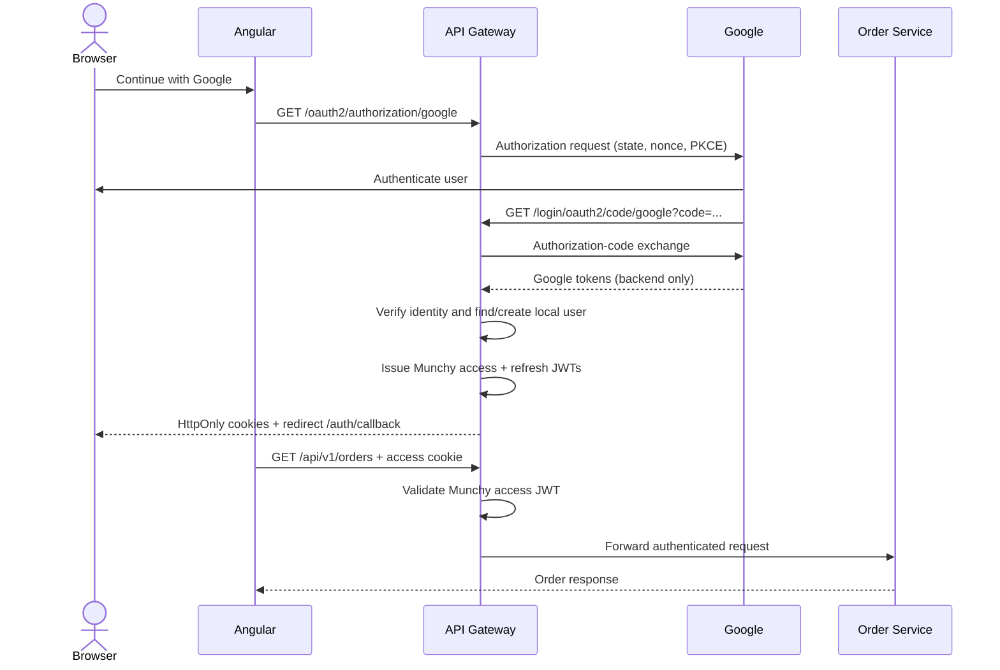

# Munchy Google OAuth2 and JWT Authentication

## Sequence



## Responsibilities

- **Angular** starts login, follows redirects, and calls APIs with `withCredentials`. It never reads tokens.
- **API Gateway** delegates Google OAuth protocol work to Spring Security, maps Google identities to local users, issues Munchy tokens, validates access tokens, and protects routes.
- **Google** authenticates the user and issues Google tokens only to the gateway.
- **Order Service** owns order business logic. It should be privately reachable only through the gateway in production.

Before forwarding, the gateway removes client-supplied `X-User-Id`, `X-User-Email`, and `X-User-Roles` headers and recreates them from the validated JWT. The order service must trust these headers only when network policy ensures requests came from the gateway.

## Google tokens and Munchy tokens

Google access, refresh, and ID tokens are never returned to Angular. Spring Security uses them only for the Google login protocol and identity verification. Normal Munchy API calls use Munchy-issued JWTs, so Google is not contacted after login.

The access JWT lasts 15 minutes by default and contains the internal Munchy user ID, email, roles, issuer, timestamps, JWT ID, and `token_type=access`. The refresh JWT lasts 7 days by default and contains `token_type=refresh`. A refresh JWT is rejected by the API resource-server validator.

## Cookies

| Cookie | Path | Default lifetime | Purpose |
|---|---|---:|---|
| `munchy_access_token` | `/` | 15 minutes | Authenticate APIs |
| `munchy_refresh_token` | `/api/v1/auth/refresh` | 7 days | Rotate tokens |
| `munchy_oauth_session` | `/` | OAuth handshake only | Preserve state and authorization request |

Token cookies are `HttpOnly`, `SameSite=Lax`, and use configurable `Secure`. `HttpOnly` prevents JavaScript token access but does not by itself prevent CSRF. CSRF is disabled for this milestone because SameSite=Lax prevents the cookies on ordinary cross-site POST requests. Before supporting untrusted same-site subdomains, add explicit CSRF tokens and stricter origin controls.

## Refresh and logout

`POST /api/v1/auth/refresh` reads only the refresh cookie, validates signature, issuer, expiry and token type, resolves the local user, then rotates both JWTs.

`POST /api/v1/auth/logout` expires both cookies. Because the design is stateless, clearing a cookie does not revoke a copied access JWT. Immediate revocation and refresh-token reuse detection require a server-side token-family store, denylist, or token version.

## Local users

The gateway currently uses a demonstration in-memory repository keyed by Google `sub` and assigns `ROLE_CUSTOMER`. Restarting the gateway clears users, so existing refresh tokens no longer resolve after restart. Replace this adapter with a user service or persistent repository before production.

## Configuration

Required environment variables:

```text
GOOGLE_CLIENT_ID
GOOGLE_CLIENT_SECRET
MUNCHY_JWT_SECRET          # at least 32 random bytes
```

Optional variables:

```text
MUNCHY_FRONTEND_SUCCESS_URL=http://localhost:4200/auth/callback
MUNCHY_FRONTEND_FAILURE_URL=http://localhost:4200/access-denied
MUNCHY_JWT_ACCESS_DURATION=15m
MUNCHY_JWT_REFRESH_DURATION=7d
MUNCHY_COOKIE_SECURE=false
MUNCHY_COOKIE_DOMAIN=
```

Google must allow this local callback:

```text
http://localhost:8080/login/oauth2/code/google
```

Use `MUNCHY_COOKIE_SECURE=true` with HTTPS in production. Never commit any listed secret.

## Run locally

```powershell
cd D:\Projects\munchy\order-service
$env:JAVA_HOME='C:\Users\hp\.jdks\openjdk-22.0.2'
.\mvnw.cmd spring-boot:run
```

```powershell
cd D:\Projects\munchy\api-gateway
$env:MUNCHY_COOKIE_SECURE='false'
.\mvnw.cmd spring-boot:run
```

```powershell
cd D:\Projects\munchy-papai-implementation\munchydemo\munchy
npm.cmd start
```

## Manual verification

1. Open `http://localhost:8080/oauth2/authorization/google`.
2. Complete Google login and confirm redirect to Angular `/auth/callback` and then `/welcome`.
3. Confirm both Munchy cookies exist without copying their values.
4. Call `GET http://localhost:8080/api/v1/orders`; expect `200`.
5. Remove the access cookie; expect `401` from the orders endpoint.
6. Call `POST /api/v1/auth/refresh`; expect `200` and rotated cookies.
7. Call orders again; expect `200`.
8. Call `POST /api/v1/auth/logout`; expect `204` and expired cookies.

## Remaining limitations

- In-memory users and no persistent refresh-token family/reuse tracking.
- Stateless access JWTs cannot be revoked immediately.
- CSRF relies on SameSite and strict CORS for this milestone.
- Downstream service network isolation and trusted identity-header propagation are not implemented yet.
