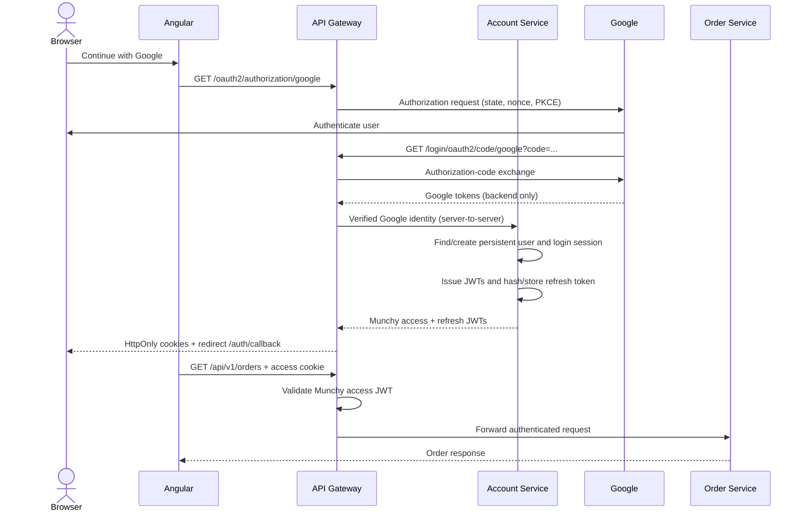

# Munchy Google OAuth2 and JWT Authentication

## Sequence



## Responsibilities

- **Angular** starts login, follows redirects, and calls APIs with `withCredentials`. It never reads tokens.
- **API Gateway** delegates Google OAuth protocol work to Spring Security, calls the Account Service after Google succeeds, sets HttpOnly cookies, validates access tokens, and protects routes.
- **Account Service** owns persistent users, Google identities, roles, login sessions, refresh-token rotation, saved addresses, consented session location, and Munchy token issuance.
- **Google** authenticates the user and issues Google tokens only to the gateway.
- **Order Service** owns order business logic. It should be privately reachable only through the gateway in production.

Before forwarding, the gateway removes client-supplied identity headers and recreates `X-User-Id`, `X-User-Email`, `X-User-Roles`, and `X-Auth-Session-Id` from the validated JWT. It also adds an internal service key derived from `MUNCHY_JWT_SECRET`; the Account Service rejects requests without it. Production still requires private service networking and TLS.

## Google tokens and Munchy tokens

Google access, refresh, and ID tokens are never returned to Angular. Spring Security uses them only for the Google login protocol and identity verification. Normal Munchy API calls use Munchy-issued JWTs, so Google is not contacted after login.

The access JWT lasts 15 minutes by default and contains the internal Munchy user ID, email, roles, issuer, timestamps, JWT ID, and `token_type=access`. The refresh JWT lasts 7 days by default and contains `token_type=refresh`. A refresh JWT is rejected by the API resource-server validator.

## Cookies

| Cookie | Path | Default lifetime | Purpose |
|---|---|---:|---|
| `munchy_access_token` | `/` | 15 minutes | Authenticate APIs |
| `munchy_refresh_token` | `/api/v1/auth` | 7 days | Rotate tokens and revoke the session on logout |
| `munchy_oauth_session` | `/` | OAuth handshake only | Preserve state and authorization request |

Token cookies are `HttpOnly`, `SameSite=Lax`, and use configurable `Secure`. `HttpOnly` prevents JavaScript token access but does not by itself prevent CSRF. CSRF is disabled for this milestone because SameSite=Lax prevents the cookies on ordinary cross-site POST requests. Before supporting untrusted same-site subdomains, add explicit CSRF tokens and stricter origin controls.

## Refresh and logout

`POST /api/v1/auth/refresh` reads only the refresh cookie. The Account Service validates the JWT and stored SHA-256 hash, locks the refresh row, marks it used, creates a replacement row, and rotates both JWTs. Reuse of an already-used refresh token revokes the stable login session.

`POST /api/v1/auth/logout` revokes the database session and active refresh token before expiring both cookies. A copied access JWT remains valid only until its short expiry; immediate access-token revocation would require a denylist or token-version check.

## Persistent accounts

The Account Service uses PostgreSQL tables under the `account` schema. Google identities are keyed by `(provider, provider_subject)`, Munchy users have internal UUIDs, new accounts receive `CUSTOMER`, and refresh tokens are stored only as SHA-256 hashes. Restarting services no longer removes users or sessions.

## Configuration

Required environment variables:

```text
GOOGLE_CLIENT_ID
GOOGLE_CLIENT_SECRET
MUNCHY_JWT_SECRET          # at least 32 random bytes
MUNCHY_ACCOUNT_DB_PASSWORD # password for local role munchy_account_app
```

Optional variables:

```text
MUNCHY_FRONTEND_SUCCESS_URL=http://localhost:4200/auth/callback
MUNCHY_FRONTEND_FAILURE_URL=http://localhost:4200/access-denied
MUNCHY_JWT_ACCESS_DURATION=15m
MUNCHY_JWT_REFRESH_DURATION=7d
MUNCHY_COOKIE_SECURE=false
MUNCHY_COOKIE_DOMAIN=
MUNCHY_ACCOUNT_SERVICE_URL=http://localhost:8082
MUNCHY_ACCOUNT_DB_HOST=localhost
MUNCHY_ACCOUNT_DB_PORT=5432
MUNCHY_ACCOUNT_DB_NAME=munchy_account
MUNCHY_ACCOUNT_DB_USERNAME=munchy_account_app
```

Google must allow this local callback:

```text
http://localhost:8080/login/oauth2/code/google
```

Use `MUNCHY_COOKIE_SECURE=true` with HTTPS in production. Never commit any listed secret.

## Run locally

```powershell
cd D:\Projects\munchy\account-service
$env:JAVA_HOME='C:\Users\hp\.jdks\openjdk-22.0.2'
$env:MUNCHY_ACCOUNT_DB_PASSWORD=[Environment]::GetEnvironmentVariable('MUNCHY_ACCOUNT_DB_PASSWORD','User')
$env:MUNCHY_JWT_SECRET=[Environment]::GetEnvironmentVariable('MUNCHY_JWT_SECRET','User')
.\mvnw.cmd spring-boot:run
```

```powershell
cd D:\Projects\munchy\order-service
$env:JAVA_HOME='C:\Users\hp\.jdks\openjdk-22.0.2'
.\mvnw.cmd spring-boot:run
```

```powershell
cd D:\Projects\munchy\api-gateway
$env:MUNCHY_COOKIE_SECURE='false'
.\mvnw.cmd spring-boot:run
```

```powershell
cd D:\Projects\munchy-papai-implementation\munchydemo\munchy
npm.cmd start
```

## Manual verification

1. Open `http://localhost:8080/oauth2/authorization/google`.
2. Complete Google login and confirm redirect to Angular `/auth/callback` and then `/welcome`.
3. Confirm both Munchy cookies exist without copying their values.
4. Call `GET http://localhost:8080/api/v1/orders`; expect `200`.
5. Remove the access cookie; expect `401` from the orders endpoint.
6. Call `POST /api/v1/auth/refresh`; expect `200` and rotated cookies.
7. Call orders again; expect `200`.
8. Call `POST /api/v1/auth/logout`; expect `204` and expired cookies.

## Remaining limitations

- Stateless access JWTs cannot be revoked immediately.
- CSRF relies on SameSite and strict CORS for this milestone.
- The Account Service is bound to loopback locally; production also needs private networking and TLS.
- Browser code for requesting and submitting consented GPS location is not implemented yet.
